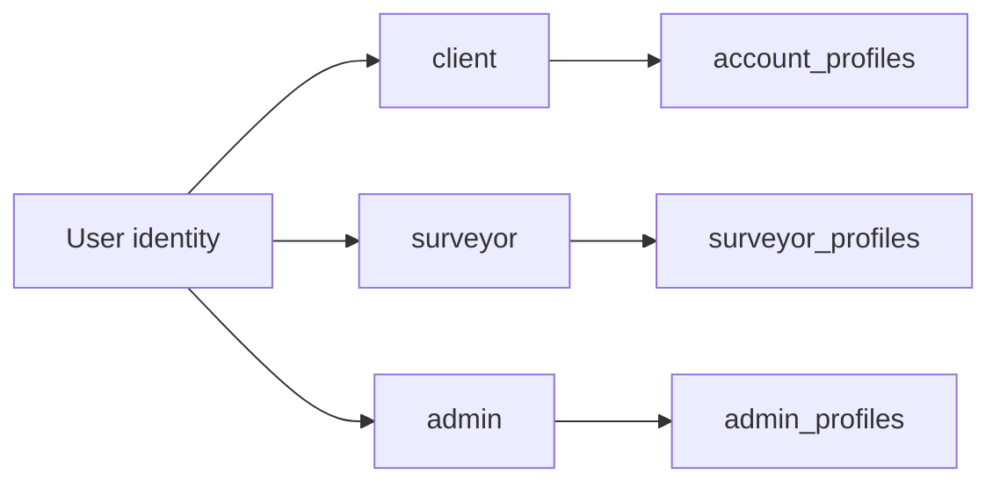
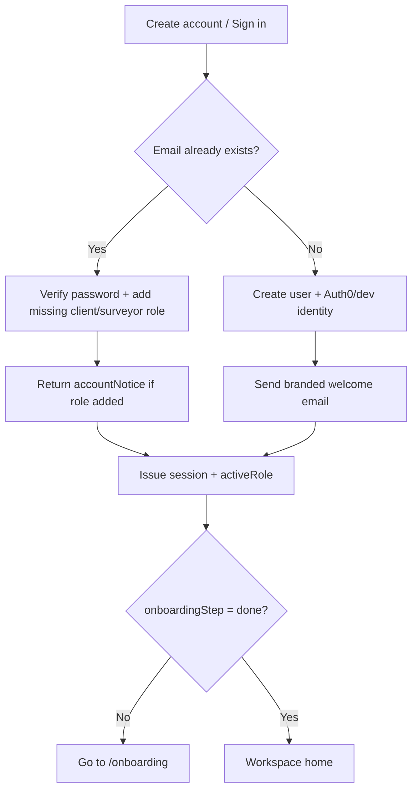
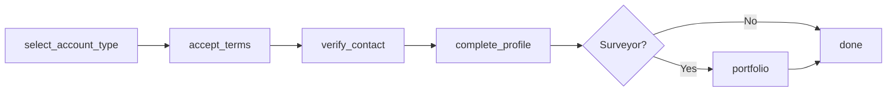
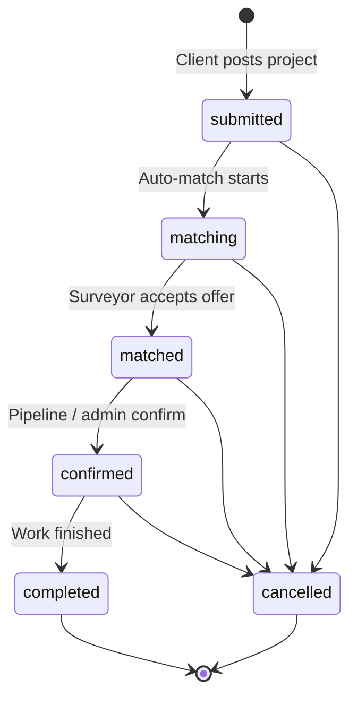
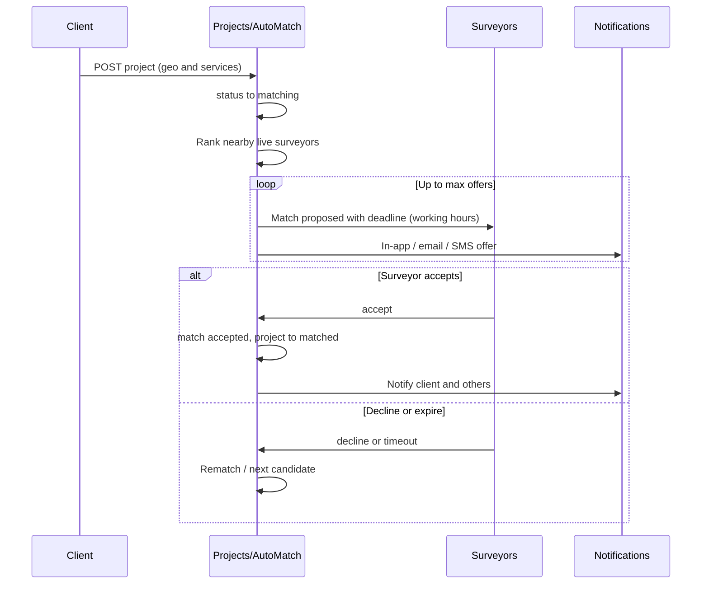

# BLD business logic

> **Living document.** Update this file whenever marketplace / auth / matching / admin / helpdesk / notification behavior changes.
> Data shape / ERD: [`docs/DATA_VISUAL.md`](./DATA_VISUAL.md) · narrative: [`apps/api/prisma/DATA_MODEL.md`](../apps/api/prisma/DATA_MODEL.md).
> Status enums & transitions: [`packages/types/src/index.ts`](../packages/types/src/index.ts).

Last reviewed: 2026-09-18

---

## 1. Product in one paragraph

BLD is a **managed marketplace**: clients post site-survey projects; the platform **auto-matches** nearby live surveyors with time-boxed offers; surveyors accept/decline; work moves through project status until completion and feedback. One person can wear **client** and/or **surveyor** (and separately **admin** staff) hats on a single identity.

---

## 2. Roles & identity

| Role | Stored in | Purpose |
|------|-----------|---------|
| `client` | `user_roles` | Post projects, track matches, leave feedback |
| `surveyor` | `user_roles` + `surveyor_profiles` | Receive offers, accept work, complete portfolio |
| `admin` | `user_roles` + `admin_profiles` | Staff portal (`/build/admin`), permissions presets |

- Access control uses **memberships**, not `users.role_hint` (legacy display only).
- Session may carry `activeRole` (`client` \| `surveyor`) for workspace routing.
- **Dual-role:** signing up again with the same email **adds** the other marketplace role; shared onboarding progress is kept; UI shows an `accountNotice`.

**Key code:** `apps/api/src/auth/memberships.ts`, `apps/api/src/auth/auth.service.ts`

---

## 3. Auth & signup

- Password signup: email/phone OTP **not** sent at create — only from onboarding **Verify contact**.
- Google: complete registration (phone + role) then same onboarding gates.
- Welcome email: branded HTML; client vs surveyor templates; SendGrid (`TwilioEmailSender`).
- Email OTP: branded verify template (`buildVerifyEmail`).

**Key code:** `auth.service.ts`, `email-otp.service.ts`, `welcome-email.ts`, `verify-email.ts`, `twilio.email-sender.ts`

---

## 4. Onboarding gate

Shared for client + surveyor:

| Step | What happens |
|------|----------------|
| `select_account_type` | Individual vs company |
| `accept_terms` | T&C + NDA (required) |
| `verify_contact` | Email OTP + phone OTP (phone required to advance) |
| `complete_profile` | Address / company fields → `account_profiles` |
| `portfolio` | Surveyors only (or client-first then adding surveyor) |
| `done` | Workspace unlocked |

**Dual-role rule:** if core onboarding is already done and surveyor is newly added → jump to `portfolio` only.

**Key code:** `auth.service.ts` (`resolveOnboardingStep`, `attachMarketplaceRole`, `surveyorNeedsPortfolioStep`), `apps/web/app/onboarding/page.tsx`

---

## 5. Client project lifecycle

Allowed transitions: `PROJECT_STATUS_TRANSITIONS` in `@surveylink/types`.

**Key code:** `apps/api/src/projects/projects.service.ts`, `apps/web/app/client/projects/**`

---

## 6. Matching & offers

- Offer deadlines use **working hours** (`matching/working-hours.ts`), not raw wall clock alone.
- Background rematch retries open `matching` projects.
- Admin can also create / manage matches from staff UI.

Match statuses: `proposed → accepted | declined | cancelled`; `accepted → completed | cancelled`.

**Key code:** `apps/api/src/matching/auto-match.service.ts`, `apps/api/src/admin/admin.service.ts`

---

## 7. Surveyor portfolio & eligibility

- Surveyor profile holds services, coverage (PostGIS), rates, portfolio JSON.
- Incomplete portfolio blocks receiving / acting on marketplace requests (web gates + matching filters for “live” surveyors).
- Profile completion % drives UI prompts (`profile-completion`, surveyor shell snooze).

**Key code:** `apps/api/src/profiles/profiles.service.ts`, `apps/web/app/surveyor/profile/page.tsx`

---

## 8. Feedback

- After completed work, client ↔ surveyor can leave feedback (one per direction per match).
- Product / landing feedback also collected for ops.

**Key code:** `apps/api/src/feedback/feedback.service.ts`

---

## 9. Helpdesk

- Authenticated users open tickets (workspace-scoped).
- Staff assign / reply in admin help desk.
- Notifications on create / reply.

**Key code:** `apps/api/src/helpdesk/helpdesk.service.ts`

---

## 10. Notifications & delivery

| Channel | Provider (staging) | Used for |
|---------|-------------------|----------|
| Email | SendGrid (`SENDGRID_API_KEY`, `TWILIO_EMAIL_FROM`) | Welcome, OTP, match/admin alerts |
| SMS | Twilio Messaging | Phone OTP, match SMS |
| In-app | `notifications` table | Bell / toasts |

Failures on welcome are best-effort (never block signup). OTP send failures surface as unavailable.

**Key code:** `apps/api/src/notifications/**`

---

## 11. Admin / staff

- Super-admin bootstrap; staff levels + permission presets.
- Pipeline / users / surveyors / projects / helpdesk / activity.
- User delete must clear surveyor profile + matches (no FK cascade on surveyor→user).

**Key code:** `apps/api/src/admin/**`, `apps/web/app/build/admin/**`

---

## 12. Module map (API)

| Module | Responsibility |
|--------|----------------|
| `auth` | Signup, login, onboarding, OTP, sessions |
| `projects` | Client briefs |
| `matching` | Auto-match loop |
| `profiles` | Account + surveyor portfolio |
| `admin` | Staff operations |
| `notifications` | Fan-out delivery |
| `helpdesk` | Tickets |
| `feedback` | Ratings |
| `media` | S3 uploads |
| `activity` | Audit-ish logs |

---

## 13. Changelog (business-facing)

| Date | Change |
|------|--------|
| 2026-09-18 | Dual-role signup notice; branded welcome (client + surveyor); branded email OTP; SendGrid synced on deploy; admin user delete clears surveyor profile |
| 2026-09-18 | **Doc created** — keep updating this table + diagrams above |

---

## Maintainer checklist

When you change behavior, update:

1. The relevant section + mermaid diagram (if flow changed)
2. The **Changelog** row
3. Cross-links if new modules / enums appear
4. `DATA_MODEL.md` if tables / relations change
