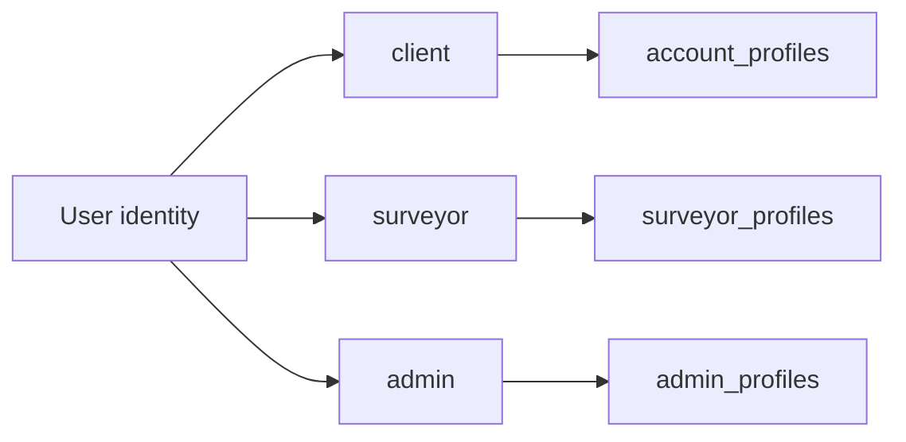
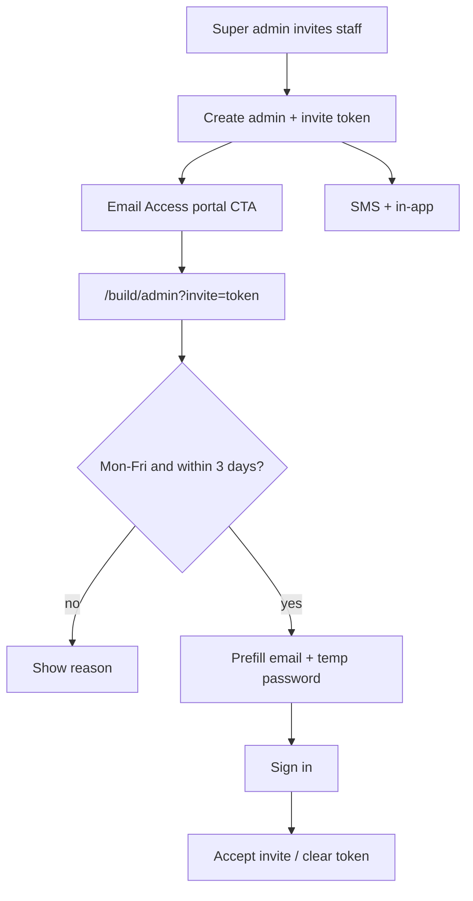
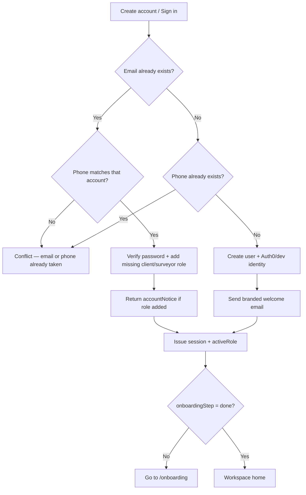
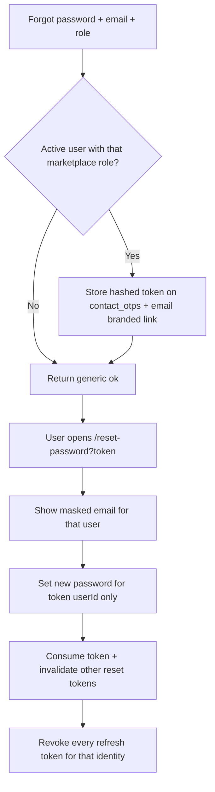
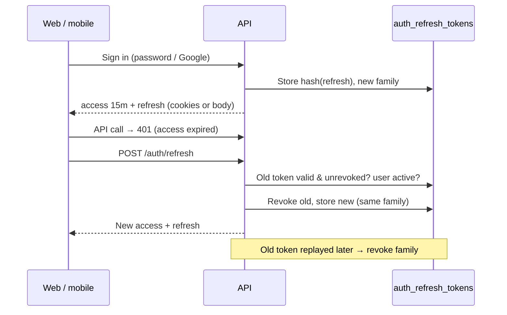
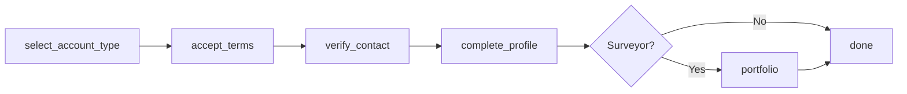
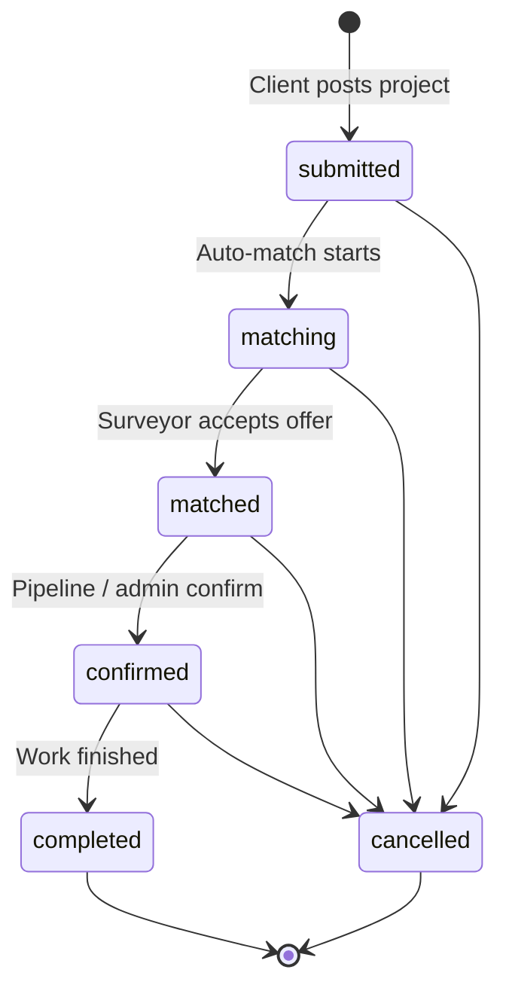
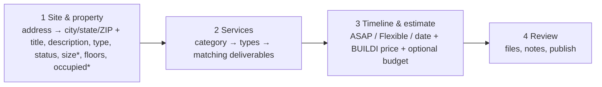
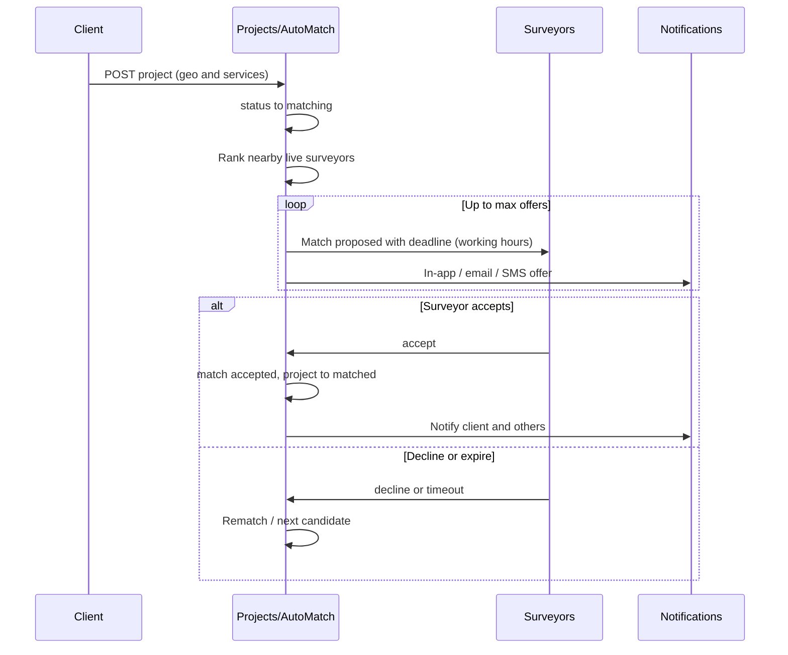

# BLD business logic

> **Living document.** Update this file whenever marketplace / auth / matching / admin / helpdesk / notification behavior changes.
> Data shape / ERD: [`docs/DATA_VISUAL.md`](./DATA_VISUAL.md) · narrative: [`apps/api/prisma/DATA_MODEL.md`](../apps/api/prisma/DATA_MODEL.md).
> Status enums & transitions: [`packages/types/src/index.ts`](../packages/types/src/index.ts).

Last reviewed: 2026-09-21

---

## 1. Product in one paragraph

BLD is a **managed marketplace**: clients post site-survey projects; the platform **auto-matches** nearby live surveyors with time-boxed offers; surveyors accept/decline; work moves through project status until completion and feedback. One person can wear **client** and/or **surveyor** (and separately **admin** staff) hats on a single identity.

---

## 2. Roles & identity

| Role | Stored in | Purpose |
|------|-----------|---------|
| `client` | `user_roles` | Post projects, track matches, leave feedback |
| `surveyor` | `user_roles` + `surveyor_profiles` | Receive offers, accept work, complete portfolio |
| `admin` | `user_roles` + `admin_profiles` | Staff portal (`/build/admin`), permissions presets |

- Access control uses **memberships**, not `users.role_hint` (legacy display only).
- Session may carry `activeRole` (`client` \| `surveyor`) for workspace routing.
- **Dual-role:** signing up again with the same email **adds** the other marketplace role; shared onboarding progress is kept; UI shows an `accountNotice`.
- **Staff invite (super admin only):** create normal admin → email with **Access portal** CTA only (no credentials or paste-URL in the mail) + SMS + in-app. Link is `/build/admin?invite=…`. System enforces **3-day TTL** and **Monday–Friday** redeem silently (not shown in user copy). Portal prefills email + temp password; successful sign-in accepts the invite. Super admin can edit any staff row (including self) and set passwords.

```mermaid
flowchart LR
  Person[User identity] --> ClientHat[client]
  Person --> SurveyorHat[surveyor]
  Person --> AdminHat[admin]
  ClientHat --> AccountProfile[account_profiles]
  SurveyorHat --> SurveyorProfile[surveyor_profiles]
  AdminHat --> AdminProfile[admin_profiles]
```

```mermaid
flowchart TD
  SA[Super admin invites staff] --> Create[Create admin + invite token]
  Create --> Mail[Email Access portal CTA]
  Create --> SMS[SMS + in-app]
  Mail --> Link["/build/admin?invite=token"]
  Link --> Peek{Mon-Fri and within 3 days?}
  Peek -->|no| Fail[Show reason]
  Peek -->|yes| Prefill[Prefill email + temp password]
  Prefill --> Login[Sign in]
  Login --> Accept[Accept invite / clear token]
```

**Key code:** `apps/api/src/auth/memberships.ts`, `apps/api/src/auth/auth.service.ts`, `apps/api/src/admin/admin.service.ts`

---

## 3. Auth & signup

```mermaid
flowchart TD
  Start["Create account / Sign in"] --> EmailCheck{"Email already exists?"}
  EmailCheck -->|Yes| PhoneMatch{"Phone matches that account?"}
  PhoneMatch -->|No| Conflict["Conflict — email or phone already taken"]
  PhoneMatch -->|Yes| AddRole["Verify password + add missing client/surveyor role"]
  EmailCheck -->|No| PhoneCheck{"Phone already exists?"}
  PhoneCheck -->|Yes| Conflict
  PhoneCheck -->|No| CreateUser["Create user + Auth0/dev identity"]
  AddRole --> Notice["Return accountNotice if role added"]
  CreateUser --> Welcome["Send branded welcome email"]
  Notice --> Session["Issue session + activeRole"]
  Welcome --> Session
  Session --> Onboard{"onboardingStep = done?"}
  Onboard -->|No| Onboarding["Go to /onboarding"]
  Onboard -->|Yes| Home["Workspace home"]
```

- **Identity uniqueness:** email and phone are both checked. Reusing one with a different other (e.g. same email + new phone, or new email + existing phone) is blocked. Dual-role only when the same email **and** matching phone (or placeholder phone) pass password verify for a role the account does not yet have.
- **Company name uniqueness:** one account per company name (case- and spacing-insensitive, e.g. "Acme  Surveys" = "acme surveys"). Saving a name another account already holds (onboarding, account details, or admin edit) is rejected with "This company name is already registered". Legacy duplicates from before the rule keep their name but must pick a unique one on their next edit.
- Password signup: email/phone OTP **not** sent at create — only from onboarding **Verify contact**.
- Google: complete registration (phone + role) then same onboarding gates.
- Welcome email: branded HTML; client vs surveyor templates; SendGrid (`TwilioEmailSender`).
- Email OTP: branded verify template (`buildVerifyEmail`).
- **OTP resend guard (email / work email / phone):** 30s between sends; max **1 initial + 3 resends** per channel per hour; after the 4th send, send **and** verify are locked for 1 hour. UI disables Resend until the timer ends, warns on the last resend, and links to create a support ticket. On lockout: **staff in-app notification** + email to `ADMIN_NOTIFY_EMAIL` (fallback `SUPER_ADMIN_EMAIL`) with link to the user. Admins with `users:manage` can **Clear OTP lockout** immediately (`otp_unlocked_at`).
- **Forgot password (marketplace only):** client/surveyor request → branded reset email with one-time **button** link (`/reset-password?token=…`, 1h TTL, bound to that `userId` via `contact_otps` channel `password_reset`). No raw paste-URL block in the HTML. UI shows success + resend + back to login. Completing the link sets Auth0 + local password verifier for that user only; token is single-use. Staff/admin accounts are never emailed a reset. Anti-enumeration: API always returns the same ok message.

```mermaid
flowchart TD
  Forgot["Forgot password + email + role"] --> Exists{"Active user with that marketplace role?"}
  Exists -->|No| SameOk["Return generic ok"]
  Exists -->|Yes| Issue["Store hashed token on contact_otps + email branded link"]
  Issue --> SameOk
  SameOk --> Open["User opens /reset-password?token"]
  Open --> Peek["Show masked email for that user"]
  Peek --> Save["Set new password for token userId only"]
  Save --> Consume["Consume token + invalidate other reset tokens"]
  Consume --> SignOut["Revoke every refresh token for that identity"]
```

### Sessions (API-owned, rotating)

Every sign-in (password, signup, Google, staff portal) is converted by the API into a **15-minute access token** + a **30-day rotating refresh token** (only its SHA-256 is stored in `auth_refresh_tokens`).

- **Web:** tokens are **httpOnly** cookies (`bld_at` SameSite=Lax, `bld_rt` SameSite=Strict, `Secure` in production). Nothing secret is in `localStorage` (only a signed-in flag + active workspace). Requests carry `X-BLD-Session: cookie`; the API **ignores the cookies without that header** (CSRF defense, forces a CORS preflight). Old localStorage tokens are wiped → one-time re-login.
- **Mobile:** tokens returned in the body and stored in **SecureStore** (Keychain / Keystore); legacy AsyncStorage sessions migrate once.
- Both clients silently call `POST /auth/refresh` on a 401, retry once, else sign out.
- **Rotation / theft detection:** each refresh issues a new token and revokes the old one. Replaying a rotated token (after a 30s multi-tab grace) **revokes the whole family**.
- **Suspended users:** blocked at login, on every authenticated request (`ActiveUserGuard`), and at refresh. Suspending a user (or staff), an admin-set staff password, or a password reset **revokes all refresh tokens**; access tokens expire within 15 minutes.
- **Logout** revokes the refresh family and clears cookies (works even with an expired access token).
- **Google OAuth state** is HMAC-signed, expires in 10 minutes, and is bound to a nonce held by the browser (httpOnly `bld_oauth` cookie) or by the mobile app (returned by start, echoed on exchange). A state/code pair cannot be completed in another browser (login CSRF).
- **Rate limits:** global 120/min per IP plus tighter auth limits (login 10/min, signup 5/min, forgot-password 5/min, refresh 30/min, Google exchange 20/min). Shared across API instances when `REDIS_URL` is set (staging: private `bld-redis` sidecar; ElastiCache for multi-host); falls back to per-process memory if Redis is down. On staging, Nginx also limits per IP before the API: credential routes (`/api/auth/login|signup|forgot-password|reset-password|refresh|oauth/*`) share 20/min with a burst of 20, other `/api/*` 20/s with a burst of 100 — excess gets `429`.

```mermaid
sequenceDiagram
  participant C as Web / mobile
  participant A as API
  participant D as auth_refresh_tokens
  C->>A: Sign in (password / Google)
  A->>D: Store hash(refresh), new family
  A-->>C: access 15m + refresh (cookies or body)
  C->>A: API call → 401 (access expired)
  C->>A: POST /auth/refresh
  A->>D: Old token valid & unrevoked? user active?
  A->>D: Revoke old, store new (same family)
  A-->>C: New access + refresh
  Note over A,D: Old token replayed later → revoke family
```

**Key code:** `auth.service.ts`, `session/session.service.ts`, `session/oauth-state.ts`, `guards/jwt-auth.guard.ts`, `email-otp.service.ts`, `welcome-email.ts`, `verify-email.ts`, `reset-password-email.ts`, `twilio.email-sender.ts`

---

## 4. Onboarding gate

Shared for client + surveyor:

```mermaid
flowchart LR
  A[select_account_type] --> B[accept_terms]
  B --> C[verify_contact]
  C --> D[complete_profile]
  D --> E{Surveyor?}
  E -->|Yes| F[portfolio]
  E -->|No| G[done]
  F --> G[done]
```

| Step | What happens |
|------|----------------|
| `select_account_type` | Individual vs company |
| `accept_terms` | T&C + Privacy Policy (one checkbox) + NDA (required). Privacy Policy at `/privacy`: no selling or sharing personal data with third parties; only service providers acting on our behalf |
| `verify_contact` | **Email OTP + phone OTP (both required)** before profile. Resend: **30s cooldown**, **3 resends** (4 sends/hour/channel), then **1h lockout** on send + verify; last-resend warning + helpdesk ticket link. Lockout alerts admins (in-app + ops email); staff can clear via **Clear OTP lockout**. |
| `complete_profile` | Address / company fields → `account_profiles` |
| `portfolio` | Surveyors only (or client-first then adding surveyor) |
| `done` | Workspace unlocked |

**Dual-role rule:** if core onboarding is already done and surveyor is newly added → jump to `portfolio` only.

**Key code:** `auth.service.ts` (`resolveOnboardingStep`, `attachMarketplaceRole`, `surveyorNeedsPortfolioStep`), `apps/web/app/onboarding/page.tsx`

---

## 5. Client project lifecycle

```mermaid
stateDiagram-v2
  [*] --> submitted: Client posts project
  submitted --> matching: Auto-match starts
  matching --> matched: Surveyor accepts offer
  matched --> confirmed: Pipeline / admin confirm
  confirmed --> completed: Work finished
  submitted --> cancelled
  matching --> cancelled
  matched --> cancelled
  confirmed --> cancelled
  completed --> [*]
  cancelled --> [*]
```

Allowed transitions: `PROJECT_STATUS_TRANSITIONS` in `@surveylink/types`.

### Posting a brief (web + mobile, "Step X of 4")

```mermaid
flowchart LR
  L["1 Site & property<br/>address → city/state/ZIP + title, description, type, status, size*, floors, occupied*"] --> S["2 Services<br/>category → types → matching deliverables"]
  S --> B["3 Timeline & estimate<br/>ASAP / Flexible / date + BUILDI price + optional budget"]
  B --> R["4 Review<br/>files, notes, publish"]
```

- **Site & property:**
  - An address is required (city, state, country). Picking one fills city/state/ZIP and names the project after the address until the client edits the title.
  - A short description (≥ 50 chars) is required.
  - Property type and approximate building size are required. **Is the Building Occupied?** (Yes / No / Partially / Not Sure, `details.occupancy`) is required unless the status is **Under construction**, where the question is hidden and cleared. Status is Existing or Under construction (the only statuses that exist; legacy Renovation / Demolition / Unknown / New construction values read back as unset); floors come from a dropdown.
  - Occupancy is shown on the review step, the client project page, and surveyor request / match cards (`SurveyorRequest.project.occupancy`).
- **Services:**
  - The client first picks one or more categories (Survey, Laser & Reality Capture, Drone, BIM & CAD), then service types from each category's dropdown.
  - The deliverables dropdown only lists items from `SERVICE_DELIVERABLES` for the chosen types. Removing a type or category drops deliverables that no longer apply.
  - At least one type and one deliverable are required. Scan type/accuracy (laser) and LOD/software (BIM) are optional dropdowns.
- **Timeline & estimate:** ASAP, Flexible or Specific date.
  - The **BUILDI AI price recommendation** (`estimateProjectPrice`) is calculated from services, size, floors, status, property type, scan type, accuracy, LOD, deliverable count and ASAP. It is saved as `details.estimateMinCents/MaxCents`.
  - The client may type an optional **budget** (or tap "Use BUILDI's price" to fill the midpoint). When set, it is saved as `details.budgetFixedCents` with `pricingMode: fixed`; when blank, `pricingMode` is `open` (surveyors quote).
  - The client doesn't choose priority, provider type, verified-only, experience, minimum rating or existing data.

**Key code:** `apps/api/src/projects/projects.service.ts`, `apps/web/app/client/projects/**`, `packages/types/src/project-brief.ts`

---

## 6. Matching & offers

```mermaid
sequenceDiagram
  participant C as Client
  participant API as Projects/AutoMatch
  participant S as Surveyors
  participant N as Notifications

  C->>API: POST project (geo and services)
  API->>API: status to matching
  API->>API: Rank nearby live surveyors
  loop Up to max offers
    API->>S: Match proposed with deadline (working hours)
    API->>N: In-app / email / SMS offer
  end
  alt Surveyor accepts
    S->>API: accept
    API->>API: match accepted, project to matched
    API->>N: Notify client and others
  else Decline or expire
    S->>API: decline or timeout
    API->>API: Rematch / next candidate
  end
```

- Offer deadlines use **working hours** (`matching/working-hours.ts`), not raw wall clock alone.
- Background rematch retries open `matching` projects.
- Admin can also create / manage matches from staff UI.

Match statuses: `proposed → accepted | declined | cancelled`; `accepted → completed | cancelled`.

**Key code:** `apps/api/src/matching/auto-match.service.ts`, `apps/api/src/admin/admin.service.ts`

---

## 7. Surveyor portfolio & eligibility

- Surveyor profile holds services, coverage (PostGIS), rates, portfolio JSON.
- **Surveyor services exclude BIM & CAD:** the portfolio (web + mobile) offers Survey Services, Laser & Reality Capture and Drone only. Previously saved BIM / CAD services are dropped the next time the surveyor saves their portfolio. Clients can still request BIM & CAD in the brief.
- **Coverage is one postal code (web):** the surveyor serves counties within the chosen distance of a single ZIP. Searching a new ZIP replaces the previous counties (no stacking across ZIPs); the saved ZIP and distance are shown again when the portfolio is reopened. Individual counties can still be removed.
- **Pricing currency is fixed to USD** (not editable in UI; normalized on save).
- **Remote services** is no longer collected in surveyor UI (field may still exist in stored JSON as legacy `false`).
- Incomplete portfolio blocks receiving / acting on marketplace requests (web gates + matching filters for “live” surveyors).
- Profile completion % drives UI prompts (`profile-completion`, surveyor shell snooze).
- Web and mobile editors use the same required fields (`SURVEYOR_PROFILE_COMPLETION_CHECKS`): services, base location + map location, availability, equipment, pricing, years of reality capture, industries, general liability insurance. **Continue** is blocked until the current stage's required fields are filled; "Available for new matches" can only be on at 100%.
**Key code:** `apps/api/src/profiles/profiles.service.ts`, `apps/web/app/surveyor/profile/page.tsx`, `apps/mobile/src/screens/surveyor/ProfileScreen.tsx`

---

## 8. Feedback

- After completed work, client ↔ surveyor can leave feedback (one per direction per match).
- Available on web and mobile (client project page, surveyor Matches tab): emoji rating, aspect stars, would-recommend, comment (min 10 chars).
- Product / landing feedback also collected for ops.

**Key code:** `apps/api/src/feedback/feedback.service.ts`

---

## 9. Helpdesk

- Authenticated users open tickets (workspace-scoped) on web or mobile (account menu → **Help & support**): category, priority (a blocker forces urgent), subject, details, up to 5 image attachments. Users can reply until the ticket is resolved / closed.
- Workspace FAQs are shared between web and mobile (`packages/types` `faqsForWorkspace`).
- Staff assign / reply in admin help desk.
- Notifications on create / reply.

**Key code:** `apps/api/src/helpdesk/helpdesk.service.ts`

---

## 10. Notifications & delivery

| Channel | Provider (staging) | Used for |
|---------|-------------------|----------|
| Email | SendGrid (`SENDGRID_API_KEY`, `TWILIO_EMAIL_FROM`) | Welcome, OTP, match/admin alerts |
| SMS | Twilio Messaging | Phone OTP, match SMS |
| In-app | `notifications` table | Bell / toasts |

Failures on welcome are best-effort (never block signup). OTP send failures surface as unavailable.

**Key code:** `apps/api/src/notifications/**`

---

## 11. Admin / staff

- Super-admin bootstrap; staff levels + permission presets.
- **Overview** (`/build/admin/queue`): network totals (incl. complete surveyor profiles), daily activity **bar chart + 7-day trend line**, services coverage bars, regional breakdown; date/region filters.
- **Users** detail: view-only by default; pencil unlocks account edit/verify; surveyor portfolio opens from the user header (**View portfolio** drawer), not a separate sidebar module.
- Pipeline / users / projects / helpdesk / activity.
- User delete must clear surveyor profile + matches (no FK cascade on surveyor→user).

**Key code:** `apps/api/src/admin/**`, `apps/web/app/build/admin/**`

---

## 12. Module map (API)

| Module | Responsibility |
|--------|----------------|
| `auth` | Signup, login, onboarding, OTP, sessions |
| `projects` | Client briefs |
| `matching` | Auto-match loop |
| `profiles` | Account + surveyor portfolio |
| `admin` | Staff operations |
| `notifications` | Fan-out delivery |
| `helpdesk` | Tickets |
| `feedback` | Ratings |
| `media` | S3 uploads |
| `activity` | Audit-ish logs |

---

## 13. Changelog (business-facing)

| Date | Change |
|------|--------|
| 2026-10-02 | Company names are unique across accounts (case/spacing-insensitive), enforced in onboarding, account details and admin edits. Web surveyor coverage is a single ZIP: a new ZIP search replaces earlier counties, and the saved ZIP + distance reappear on reopen. Coverage "Travel nationwide / International projects" removed from the web portfolio (stored values kept). BIM & CAD removed from the surveyor services form (web + mobile); saved BIM/CAD services drop on next portfolio save |
| 2026-10-01 | Privacy: new public Privacy Policy page (`/privacy`). Sign-up (web + mobile) states we never sell or share personal data with third parties and links Terms + Privacy. The onboarding Terms checkbox now covers the Privacy Policy. Welcome email and landing footer link to it. Surveyor portfolio: **Historic Monuments** added to Industries served |
| 2026-10-01 | Brief cleanup: "Within 3 / 7 / 14 / 30 days" timelines, "Do you already have project data?", provider preferences, experience and minimum rating are removed from the brief entirely (timeline is ASAP / Flexible / Specific date only; old values read back as unset). Surveyor search "Minimum rating" filter is unchanged |
| 2026-10-01 | Brief: new "Is the Building Occupied?" (Yes / No / Partially / Not Sure) on web and mobile, required except for buildings Under construction (not asked), shown to surveyors on request / match cards and on the client project page. Building status options Renovation, Demolition, Unknown and New construction are removed everywhere |
| 2026-09-30 | Mobile app matches web. Clients get a project status timeline, all matches, feedback and draft resume. Surveyors get the full brief on request cards with a working-hours timer, a dashboard with pending items, and feedback on matches. Both roles get a help desk (tickets, replies, attachments, FAQs). The mobile portfolio now collects the remaining web-required fields (years of reality capture, insurance, daily capacity, minimum project, travel charges), so it can reach 100% |
| 2026-09-30 | Brief price step: recommendation branded as **BUILDI AI**. The client can type an optional budget (saved as fixed pricing); leaving it blank keeps open quotes |
| 2026-09-30 | New brief is now 4 steps: Property is merged into step 1 (Site & property), and the site address is always required (the "not confirmed yet" option is removed). Services are picked as category, then type dropdowns, then a filtered deliverables dropdown. Site access questions are removed |
| 2026-09-30 | New brief is 5 steps ("Step X of 5"). Location and overview are merged, and the title is auto-named from the address. Services now show only the deliverables relevant to them. Property is simplified (Existing / Under construction, size required, floors dropdown). Timeline is ASAP / Flexible / date. Pricing choice is replaced by a read-only recommended price. Priority, existing-data and provider preferences (verified / experience / rating) are removed |
| 2026-09-30 | Notification emails (match found / matched / new request / accepted, feedback thanks, help desk, ops alerts) use the branded BLD template: greeting by first name, project details card, button CTA, support footer. Triggers and SMS unchanged |
| 2026-09-30 | Addresses: picking a place (New brief search, map pin, current location, onboarding / profile address) autofills country, state, city and ZIP. All distances and search radii are shown in **miles** (client surveyor search, surveyor requests / matches, admin matcher, mobile); API still stores km |
| 2026-09-29 | Abuse protection: staging rate limits now shared via Redis; Nginx per-IP edge limit on sign-in / sign-up / reset / refresh / OAuth (429 on bursts) |
| 2026-09-29 | Security: httpOnly cookie sessions (web) / SecureStore (mobile), 15m access + rotating refresh with reuse detection; sign-out everywhere on suspend / password reset; Google OAuth state bound to browser nonce; tighter auth rate limits (Redis-shareable) |
| 2026-09-24 | OTP lockout: admin in-app + email alert; staff can clear OTP lockout immediately on user detail |
| 2026-09-24 | OTP resend: 30s cooldown, 3 resends then 1h lockout (send+verify), last-attempt warning, support ticket link |
| 2026-09-24 | Onboarding UI: personalized **Hi, {name}** welcome through the flow; step rail with animated icons + clearer active/done states |
| 2026-09-21 | Profile **Complete verification**: stays on profile; sends email/SMS OTP immediately, inline 6-digit entry auto-verifies (no onboarding redirect) |
| 2026-09-21 | Staff invite email: Access portal CTA only; no credentials / paste URL / Mon–Fri or TTL copy (rules enforced silently) |
| 2026-09-21 | Staff invite: right-drawer create, email Access portal CTA + SMS/in-app, 3-day Mon–Fri link prefills portal credentials; super admin pencil edit + password (masked + eye) |
| 2026-09-21 | Admin sidebar: **Surveyors** nav removed — portfolio managed from Users detail drawer |
| 2026-09-21 | Admin user detail: view-only by default; pencil unlocks account edit; **View portfolio** drawer also has circled pencil to edit surveyor portfolio |
| 2026-09-19 | Verify contact: Continue after both email+phone verified; heal stuck `verify_contact` when contacts already done |
| 2026-09-19 | Signup: email **and** phone uniqueness (partial reuse blocked); dual-role requires matching phone; reset email paste-link removed; portfolio currency locked to USD; Remote services UI removed |
| 2026-09-19 | Admin **surveyor directory + overview analytics**: complete-profile visibility, service coverage charts, activity bars with trend line, quick + advanced surveyor filters, full profile dossier |
| 2026-09-19 | Marketplace **forgot password**: branded reset email, success/resend UI, `/reset-password` bound to requesting user only |
| 2026-09-19 | Onboarding **email + phone** both mandatory to leave Verify contact / complete profile |
| 2026-09-18 | Dual-role signup notice; branded welcome (client + surveyor); branded email OTP; SendGrid synced on deploy; admin user delete clears surveyor profile |
| 2026-09-18 | **Doc created** — keep updating this table + diagrams above |

---

## Maintainer checklist

When you change behavior, update:

1. The relevant section + mermaid diagram (if flow changed)
2. The **Changelog** row
3. Cross-links if new modules / enums appear
4. `DATA_MODEL.md` if tables / relations change
