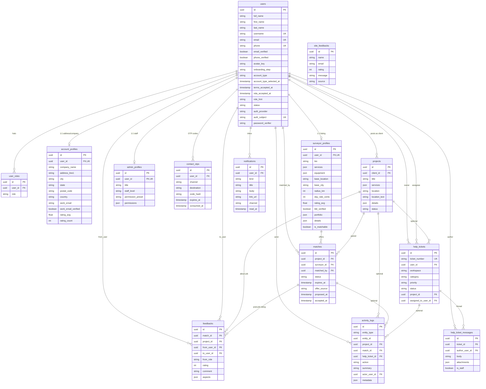
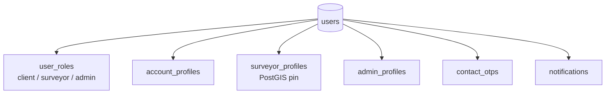
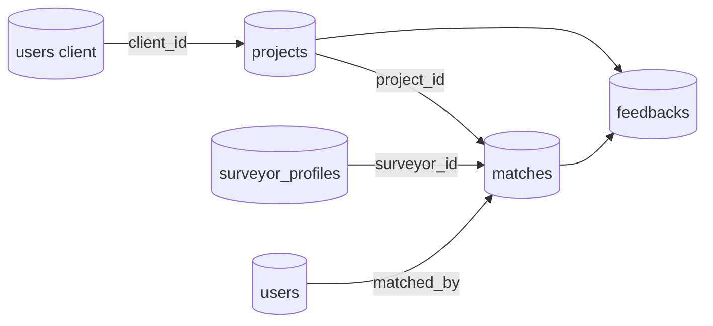
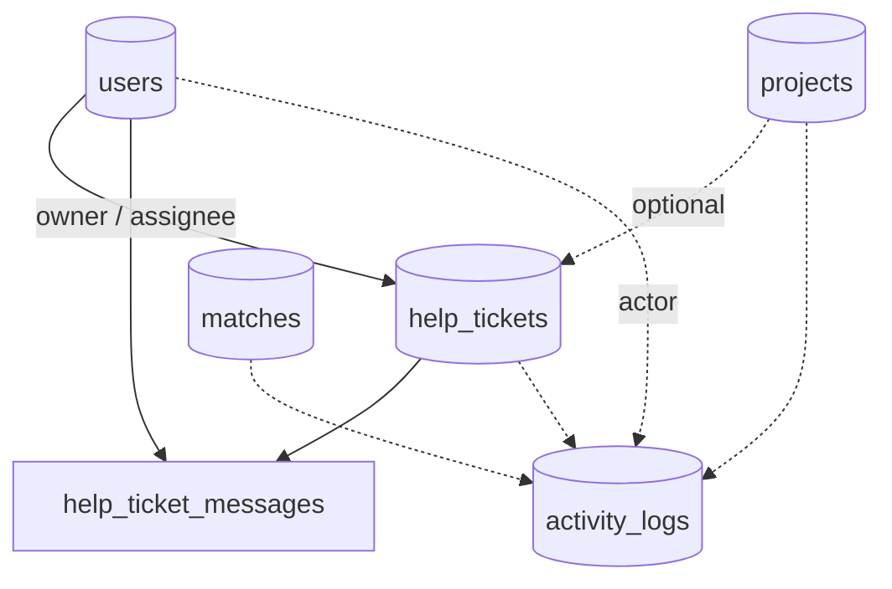

# BLD data model — live visual

> **Living ERD.** Open this file in Cursor / GitHub preview to see tables and relations.
> Source of truth: [`apps/api/prisma/schema.prisma`](../apps/api/prisma/schema.prisma) + migrations.
> Narrative companion: [`apps/api/prisma/DATA_MODEL.md`](../apps/api/prisma/DATA_MODEL.md).
> Product flows: [`docs/BUSINESS_LOGIC.md`](./BUSINESS_LOGIC.md).

Last synced from schema: **2026-09-19**

---

## Full schema (entity–relationship)

---

## By domain group

### Person & profiles

### Marketplace jobs

### Help desk & activity

`site_feedbacks` is standalone (landing page); no FK to `users`.

---

## Cascade / delete notes (important)

| Relation | On delete |
|----------|-----------|
| Most profile / OTP / role / feedback / ticket → `users` | **Cascade** |
| `surveyor_profiles.user_id` → `users` | **No cascade** — admin delete must remove profile first |
| `projects.client_id` / `matches.*` → users/profiles | App-managed (no Prisma cascade on all) |
| `notifications.user_id` | No cascade in Prisma — delete notifications before user |
| Help ticket assignee | **SetNull** |
| Activity log FKs | **SetNull** where optional |

---

## Status / enum columns (string CHECKs in SQL)

| Table | Column | Values (app) |
|-------|--------|----------------|
| `users` | `onboarding_step` | select_account_type → … → done |
| `users` | `account_type` | individual \| company |
| `user_roles` | `role` | client \| surveyor \| admin |
| `projects` | `status` | submitted → matching → matched → confirmed → completed \| cancelled |
| `matches` | `status` | proposed \| accepted \| declined \| completed \| cancelled |
| `matches` | `offer_source` | admin \| auto |
| `help_tickets` | `status` | open \| in_progress \| waiting \| resolved \| closed |
| `notifications` | `channel` | in_app \| email \| sms |

See `@surveylink/types` for transition maps.

---

## Table inventory

| Table | Group |
|-------|--------|
| `users` | Person |
| `user_roles` | Person |
| `account_profiles` | Profiles |
| `surveyor_profiles` | Profiles |
| `admin_profiles` | Profiles |
| `projects` | Jobs |
| `matches` | Jobs |
| `feedbacks` | Jobs |
| `site_feedbacks` | Plumbing / marketing |
| `help_tickets` | Support |
| `help_ticket_messages` | Support |
| `activity_logs` | Ops |
| `contact_otps` | Plumbing |
| `notifications` | Plumbing |

---

## Changelog

| Date | Change |
|------|--------|
| 2026-09-19 | `contact_otps.channel` check allows `password_reset` (forgot-password tokens) |
| 2026-09-18 | **Doc created** from current `schema.prisma` (full ERD + domain views + cascade notes) |

---

## Maintainer checklist

When you change `schema.prisma` or add a migration:

1. Update the **Full schema** mermaid `erDiagram` (entities + relationships).
2. Update domain diagrams / inventory / cascade notes if affected.
3. Bump **Last synced** date and add a **Changelog** row.
4. Keep `DATA_MODEL.md` prose in sync for human-readable grouping.
